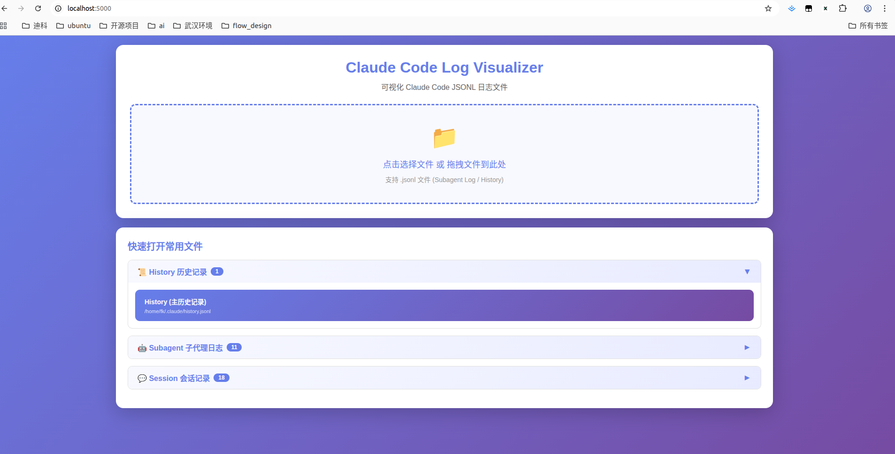
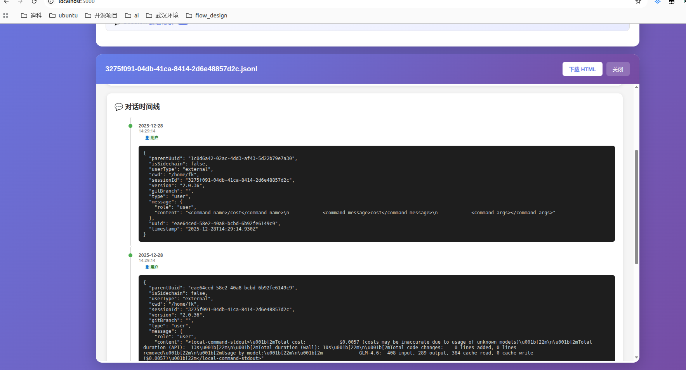
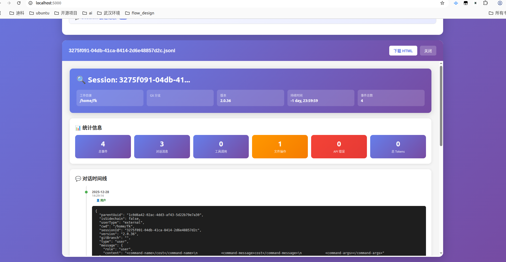
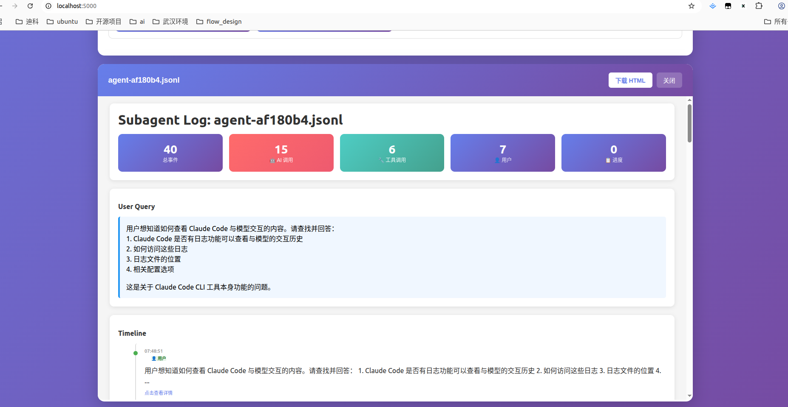
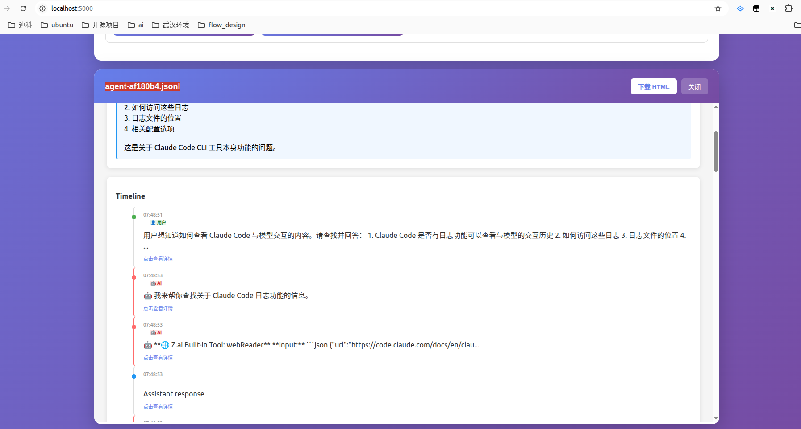

# Claude Code Log 可视化工具

一套用于可视化 Claude Code JSONL 日志文件的完整工具集，支持 Web 界面和命令行两种使用方式。

[相关源码](https://github.com/kunge2013/claude-code-guide/tree/main/log_%E5%88%86%E6%9E%90)

**log_分析工具**

```js
├── log_分析
│   ├── 启动可视化工具.bat
│   ├── 审查visualizer_server.md
│   ├── ARCHITECTURE.md
│   ├── history_visualizer.py
│   ├── README.md
│   ├── subagent_log_visualizer.py
│   └── visualizer_server.py

```

## 功能特性

- 🌐 **Web 界面** - 基于 Flask 的交互式 Web 服务器
- 📊 **多种日志支持** - History、Session、Subagent 三种日志类型
- 🔍 **智能关联** - 自动发现并显示相关的日志文件
- 📈 **统计图表** - 活动时间线、命令使用统计、工具调用分析
- 💾 **HTML 导出** - 生成可独立使用的 HTML 报告
- 🎨 **美观界面** - 现代化的渐变色设计风格

## 效果展示

### 主界面

打开 Web 服务器后，可以看到一个清爽的主界面：



界面包含：
- **文件上传区域** - 支持拖拽或点击上传 .jsonl 文件
- **快速访问** - 自动列出常用的日志文件
- **分组显示** - 按 History、Session、Subagent 分组

### History 历史记录可视化

点击 History 文件后，可以查看完整的历史记录：



**统计信息包括：**
- 总记录数、会话数、项目数
- 时间跨度统计
- 最常用的命令排行



**详细视图包含：**
- 📅 按小时的活动分布图
- 📜 最近 100 条记录时间线
- 🔢 命令使用频率统计

### Session 会话记录可视化

查看单个会话的完整对话记录，包含：
- 对话时间线
- 工具调用详情
- 文件操作记录
- 系统事件（错误、重试等）

### Subagent Agent 记录可视化

查看子代理的执行过程：



**Agent 统计：**
- 用户查询内容
- 事件总数统计
- AI 调用次数
- 工具调用次数



**详细时间线：**
- 用户消息 👤
- AI 响应 🤖
- 工具调用 🔧
- 进度更新 📋

点击任意时间线节点可查看完整的 JSON 详情。

## 快速开始

### 方式一：Web 界面（推荐）

```bash
# 进入项目目录
cd ~/workspace/github/claude_guide/log_分析

# 启动 Web 服务器
python visualizer_server.py

# 浏览器访问
# http://localhost:5000
```

启动后会看到欢迎信息：

```
╔════════════════════════════════════════════════════════════╗
║       Claude Code Log Visualizer Web Server               ║
╠════════════════════════════════════════════════════════════╣
║  Open your browser and go to:                              ║
║  http://localhost:5000                                      ║
╠════════════════════════════════════════════════════════════╣
║  Features:                                                 ║
║  - Drag & drop JSONL files                                 ║
║  - Quick access to common files                            ║
║  - Live preview in browser                                 ║
║  - Download generated HTML                                 ║
╚════════════════════════════════════════════════════════════╝
```

### 方式二：命令行工具

```bash
# 可视化 History 日志
python history_visualizer.py ~/.claude/history.jsonl

# 可视化 Subagent 日志
python subagent_log_visualizer.py ~/.claude/projects/<session>/subagents/agent-xxx.jsonl

# 自动打开生成的 HTML
python history_visualizer.py ~/.claude/history.jsonl --open
```

## 详细使用指南

### Web 界面使用步骤

#### 第一步：启动服务

```bash
python visualizer_server.py
```

#### 第二步：打开浏览器

访问 `http://localhost:5000`，您将看到主界面。

#### 第三步：选择日志文件

**方式 A - 快速访问（推荐）**

主界面会自动显示：
- 📜 History（主历史记录）
- 💬 Session（最近的会话）
- 🤖 Subagent（子代理记录）

点击任意文件即可查看。

**方式 B - 上传文件**

1. 点击上传区域
2. 选择 .jsonl 文件
3. 等待解析完成

**方式 C - 拖拽上传**

直接将 .jsonl 文件拖拽到上传区域。

#### 第四步：查看可视化

解析完成后会自动显示：
- 统计卡片（顶部）
- 详细内容（中部）
- 相关文件链接（底部）

#### 第五步：导出报告

点击右上角的 **"下载 HTML"** 按钮，保存为独立文件。

#### 第六步：查看相关文件

在页面底部的 **"🔗 相关文件"** 区域，可以跳转到相关的日志文件：
- History → Session 文件
- Session → Subagent 文件
- Subagent → 父 Session 文件

### 命令行工具详细用法

#### History Visualizer

```bash
# 基本用法 - 生成与输入同名的 HTML 文件
python history_visualizer.py ~/.claude/history.jsonl
# 输出: ~/.claude/history.html

# 指定输出文件
python history_visualizer.py input.jsonl -o my_report.html

# 生成后自动打开浏览器
python history_visualizer.py input.jsonl --open

# 组合使用
python history_visualizer.py ~/.claude/history.jsonl -o ~/Desktop/report.html --open
```

#### Subagent Log Visualizer

```bash
# 基本用法
python subagent_log_visualizer.py agent-xxx.jsonl

# 指定输出并打开
python subagent_log_visualizer.py input.jsonl -o report.html --open
```

## 支持的日志类型

### 1. History 日志

**路径**: `~/.claude/history.jsonl`

**用途**: 记录所有会话的命令历史

**内容**:
- 时间戳
- 会话 ID
- 项目路径
- 用户输入

**可视化内容**:
- 📊 统计概览（总条目数、会话数、项目数、时间跨度）
- 📈 命令使用统计（最常用的斜杠命令）
- 📅 活动模式（按小时的活动分布图）
- 🗂️ 项目列表（使用最多的项目）
- 📜 时间线（最近的 100 条记录）

### 2. Session 日志

**路径**: `~/.claude/projects/<sessionId>.jsonl`

**用途**: 单个会话的完整日志

**内容**:
- 用户消息
- AI 助手回复
- 工具调用
- 文件操作快照
- 系统事件（错误、重试）

**可视化内容**:
- 📋 会话元数据（工作目录、Git 分支、版本）
- 💬 对话时间线（完整的对话链）
- 🔧 工具调用（所有工具及其结果）
- 📁 文件操作（文件历史记录）
- ⚠️ 系统事件（API 错误和重试）

### 3. Subagent 日志

**路径**: `~/.claude/projects/<sessionId>/subagents/agent-*.jsonl`

**用途**: 子代理执行过程日志

**内容**:
- 触发 Agent 的用户查询
- Agent 的思考过程
- 工具调用记录
- 进度更新

**可视化内容**:
- 🎯 用户查询（原始请求）
- 📊 事件统计（AI 调用、工具调用数）
- 🔧 工具分组（按工具类型分组）
- 📜 事件时间线（带类型标注）

## 项目结构

```
log_分析/
├── visualizer_server.py      # Flask Web 服务器（主程序）
├── history_visualizer.py      # History 日志 CLI 工具
├── subagent_log_visualizer.py # Subagent 日志 CLI 工具
├── 启动可视化工具.bat         # Windows 快捷启动脚本
├── 效果图/                    # 界面截图
│   ├── 1.主界面.png
│   ├── 2.历史会话.png
│   ├── 3.历史会话2.png
│   ├── 4.agent记录.png
│   └── 5.agent记录2.png
├── README.md                  # 本文档
├── ARCHITECTURE.md            # 架构详细文档
└── 审查visualizer_server.md   # 代码审查报告
```

## 高级功能

### 相关文件自动关联

系统会根据 `sessionId` 和 `agentId` 自动发现相关文件：

| 当前查看 | 可跳转到 |
|----------|----------|
| **History** | → 该会话的 Session 文件 |
| **Session** | → 该会话的 Subagent 文件 |
| **Subagent** | → 父 Session 文件 |

### JSON 详情查看

在时间线中，点击任意事件节点可以展开查看完整的 JSON 数据：

```json
{
  "type": "assistant",
  "timestamp": "2024-01-17T10:00:00Z",
  "message": {
    "content": [...],
    "model": "claude-3-opus-4-20250219",
    "usage": {
      "input_tokens": 1000,
      "output_tokens": 500
    }
  }
}
```

### 统计数据解读

#### History 统计

- **Total Entries**: 总命令条目数
- **Sessions**: 独立会话数
- **Projects**: 操作过的项目数
- **Time Span**: 记录跨越的天数

#### Session 统计

- **总事件**: 所有事件数量
- **对话消息**: user + assistant 消息数
- **工具调用**: 工具使用次数
- **文件操作**: 文件修改次数
- **API 错误**: API 调用失败次数
- **总 Tokens**: 输入 + 输出 token 数

#### Subagent 统计

- **总事件**: 所有事件数
- **AI 调用**: assistant 类型事件数
- **工具调用**: tool_use 类型事件数
- **用户消息**: user 类型事件数
- **进度更新**: progress 类型事件数

## 技术栈

| 组件 | 技术 |
|------|------|
| Web 框架 | Flask |
| 数据处理 | Python JSON, datetime, pathlib |
| HTML 生成 | 模板字符串 + 内联 CSS/JS |
| 文件类型检测 | JSON Schema 推断 |
| 浏览器兼容 | 现代浏览器（ES6+） |

## 常见问题

### Q: 端口 5000 被占用怎么办？

A: 修改 `visualizer_server.py` 最后一行的端口号：

```python
app.run(host='127.0.0.1', port=8080, debug=False)
```

### Q: 日志文件很大导致加载缓慢？

A: Web 界面会自动限制显示最近 100 条记录。如需查看更多：
1. 使用命令行工具
2. 或修改 `visualizer_server.py` 中的显示限制

### Q: 生成的 HTML 如何分享给他人？

A: 生成的 HTML 文件是完全独立的，包含所有样式和脚本，可以：
- 通过邮件发送
- 上传到网盘
- 托管到 Web 服务器

### Q: 如何自定义界面颜色？

A: 编辑 `visualizer_server.py` 中的 `HTML_TEMPLATE` 变量，找到 `<style>` 标签：

```css
/* 主渐变色 */
background: linear-gradient(135deg, #667eea 0%, #764ba2 100%);

/* 修改为你喜欢的颜色 */
background: linear-gradient(135deg, #your-color1 0%, #your-color2 100%);
```

### Q: Windows 用户如何快速启动？

A: 双击 `启动可视化工具.bat` 文件即可。

### Q: 支持哪些浏览器？

A: 支持所有现代浏览器：
- Chrome/Edge 90+
- Firefox 88+
- Safari 14+

## 开发扩展

### 添加新的日志类型

1. 创建新的 Parser 类（参考 `HistoryParser`）
2. 实现 `parse()` 方法
3. 添加 HTML 生成函数
4. 更新 `detect_file_type()` 函数
5. 在 Flask 路由中添加处理分支

详细步骤请参考 [ARCHITECTURE.md](ARCHITECTURE.md)。

### 添加新的统计指标

编辑对应 Parser 类的 `_build_statistics()` 方法：

```python
def _build_statistics(self) -> Dict[str, Any]:
    stats = {
        # 现有统计...
        'my_custom_metric': self._calculate_custom_metric()
    }
    return stats
```

## 许可证

MIT License

## 作者

kunge2013
