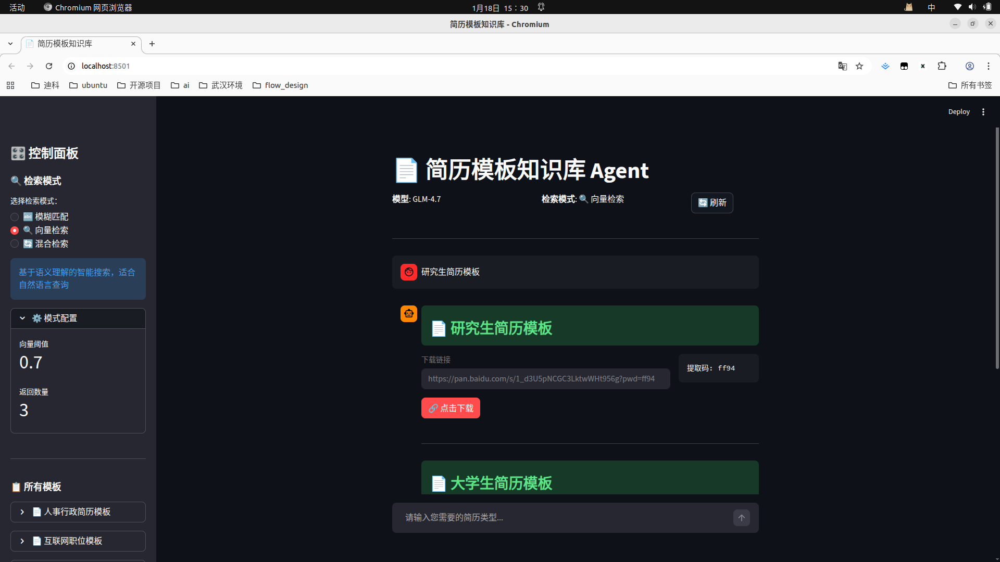

# 简历模板知识库 Agent

> GitHub 仓库：https://github.com/kunge2013/claude-code-guide/tree/main/simple-project/agent_for_resume

## 1. 项目简介

简历模板知识库 Agent 是一个基于 LangChain 和智谱 AI GLM-4.7 模型构建的智能查询助手。它可以帮助用户从精心整理的简历模板库中快速找到匹配的模板，并提供对应的百度网盘下载链接。

### 核心功能

- **自然语言查询**：支持中文自然语言查询，理解用户需求
- **多种检索模式**：支持模糊检索、向量检索、混合检索三种模式
- **Web/CLI 双界面**：提供命令行和 Web 两种使用方式
- **智能匹配**：基于语义理解的模板匹配，提高查询准确率

### 支持的简历模板

| 序号 | 模板名称 | 适用人群 |
|------|----------|----------|
| 1 | 人事行政简历模板 | HR、行政专员 |
| 2 | 互联网职位模板 | 程序员、产品经理、运营 |
| 3 | 医生护士简历模板 | 医疗行业从业者 |
| 4 | 大学生简历模板 | 应届毕业生、实习生 |
| 5 | 教师幼师简历模板 | 教育行业从业者 |
| 6 | 研究生简历模板 | 硕士、博士研究生 |
| 7 | 财会金融简历模板 | 财务、金融从业者 |
| 8 | 通用简历模板 | 所有求职者 |

---

## 2. 系统架构

### 架构概览

本项目采用分层架构设计，各层职责清晰：

```
┌─────────────────────────────────────────┐
│  用户界面层 (User Interface Layer)      │
│  - CLI 命令行接口 (resume_agent.py)     │
│  - Web 界面 (app.py - Streamlit)        │
├─────────────────────────────────────────┤
│  Agent 层 (LangChain)                   │
│  - ResumeTemplateAgent                  │
│  - 工具集 (search, list, exact match)   │
├─────────────────────────────────────────┤
│  检索策略层 (Search Strategy Layer)     │
│  - FuzzySearchStrategy (模糊匹配)       │
│  - VectorSearchStrategy (向量检索)      │
│  - HybridSearchStrategy (混合检索)      │
├─────────────────────────────────────────┤
│  数据与基础设施层 (Data & Infra)        │
│  - Excel 知识库                         │
│  - Milvus 向量数据库                    │
│  - FlagEmbedding (BGE 嵌入模型)         │
└─────────────────────────────────────────┘
```

### 核心组件说明

| 组件 | 文件路径 | 功能说明 |
|------|----------|----------|
| Agent 实现 | `resume_agent/agent.py` | LangChain Agent 主逻辑，集成 GLM-4.7 |
| 工具集 | `resume_agent/tools.py` | 查询知识库的 LangChain Tools |
| 配置管理 | `resume_agent/config.py` | 环境变量与配置管理 |
| 检索策略 | `resume_agent/strategies/` | 三种检索策略实现 |
| Milvus 仓库 | `resume_agent/repositories/milvus_repository.py` | 向量数据库操作 |
| 嵌入服务 | `resume_agent/embeddings/flag_embedding.py` | BGE 文本嵌入服务 |
| Web 界面 | `app.py` | Streamlit Web 界面 |
| CLI 入口 | `resume_agent.py` | 命令行入口 |

### 技术栈

| 组件 | 技术 | 版本要求 |
|------|------|----------|
| Agent 框架 | LangChain | >= 0.1.0 |
| 大语言模型 | 智谱 AI GLM-4.7 | - |
| Web 框架 | Streamlit | >= 1.28.0 |
| 数据处理 | pandas + openpyxl | >= 2.0.0, >= 3.1.0 |
| 模糊匹配 | thefuzz | >= 0.20.0 |
| 向量数据库 | pymilvus | >= 2.3.0 |
| 文本嵌入 | FlagEmbedding | >= 1.2.0 |
| 配置管理 | python-dotenv | >= 1.0.0 |

---

## 3. 安装与配置

### 环境要求

- Python >= 3.8
- pip 包管理器

### 安装步骤

1. **克隆项目**
```bash
cd /home/fk/workspace/github/claude_guide/simple-project/agent_for_resume
```

2. **安装依赖**
```bash
pip install -r requirements.txt
```

3. **配置环境变量**

复制 `.env.example` 为 `.env` 并修改配置：

```bash
cp .env.example .env
```

编辑 `.env` 文件，配置以下必填项：

```bash
# 智谱 AI API 配置（必填）
ANTHROPIC_AUTH_TOKEN=your_api_token_here
ANTHROPIC_BASE_URL=https://open.bigmodel.cn/api/anthropic
ANTHROPIC_DEFAULT_HAIKU_MODEL=GLM-4.7

# 检索模式配置（可选，默认：fuzzy）
SEARCH_MODE=fuzzy  # fuzzy | vector | hybrid

# Hugging Face 镜像（国内用户推荐）
HF_ENDPOINT=https://hf-mirror.com
```

### 向量检索模式配置（可选）

如需使用向量检索或混合检索模式，需要额外配置 Milvus：

1. **安装并启动 Milvus**

```bash
# 使用 Docker 启动 Milvus
docker run -d --name milvus-standalone \
  -p 19530:19530 \
  -v ~/milvus:/var/lib/milvus \
  milvusdb/milvus:latest
```

2. **配置 Milvus 连接**（在 `.env` 中）

```bash
# Milvus 服务器配置
MILVUS_HOST=localhost
MILVUS_PORT=19530
MILVUS_COLLECTION_NAME=resume_templates

# Embedding 模型配置
EMBEDDING_MODEL_NAME=BAAI/bge-small-zh-v1.5
EMBEDDING_DIMENSION=512
EMBEDDING_DEVICE=cpu
```

3. **初始化向量数据库**

```bash
python scripts/init_milvus.py
```

---

## 4. 使用指南

### 4.1 三种检索模式

| 模式 | 说明 | 优点 | 缺点 | 适用场景 |
|------|------|------|------|----------|
| **模糊检索** | 基于 thefuzz 的字符串相似度匹配 | 快速、无额外依赖 | 理解能力有限 | 精确关键词查询 |
| **向量检索** | 基于 Milvus 的语义向量搜索 | 理解自然语言、语义匹配 | 需要 Milvus、速度较慢 | 自然语言查询 |
| **混合检索** | 结合模糊和向量检索（默认 70%+30%） | 准确率最高 | 配置复杂 | 生产环境推荐 |

### 4.2 使用方式

#### 方式一：CLI 命令行

```bash
# 交互模式
python resume_agent.py --mode interactive

# 单次查询
python resume_agent.py --mode single --query "人事行政"

# 演示模式
python resume_agent.py --mode demo
```

#### 方式二：Web 界面

```bash
# 启动 Web 服务
streamlit run app.py
```

浏览器访问 `http://localhost:8501`

### 4.3 使用示例

#### Web 界面使用示例



*图 1: Web 界面基础检索功能展示*

上图展示了 Streamlit Web 界面的基本使用方法：

- **左侧边栏**：可切换搜索模式（模糊检索/向量检索/混合检索）
- **中间聊天区域**：显示用户查询和 Agent 响应
- **右侧模板列表**：展示所有可用的简历模板

#### 查询示例

**示例 1：直接询问**
```
用户：你好，我需要一个人事行政简历模板
Agent：为你找到以下简历模板：

**模板名称**: 人事行政简历模板
**下载地址**: https://pan.baidu.com/s/1sgkqxM8--OoY9Aw26FExxg?pwd=he3b
```

**示例 2：自然语言查询**
```
用户：我是个刚毕业的大学生，想找个适合的简历模板
Agent：为你找到以下简历模板：

**模板名称**: 大学生简历模板
**下载地址**: https://pan.baidu.com/s/xxx...
```

**示例 3：查看所有模板**
```
用户：有哪些简历模板可以用？
Agent：目前可用的简历模板包括：
1. 人事行政简历模板
2. 互联网职位模板
3. 医生护士简历模板
4. 大学生简历模板
5. 教师幼师简历模板
6. 研究生简历模板
7. 财会金融简历模板
8. 通用简历模板
```

---

## 5. 支持的查询方式

用户可以通过以下方式查询简历模板：

- 直接询问：`"xxx简历模板"`
- 需求描述：`"我需要xxx简历"`
- 询问式：`"有没有xxx的简历"`
- 关键词：`"人事行政"`、`"互联网"`、`"医生护士"` 等
- 职位名称：`"程序员"`、`"教师"`、`"会计"` 等

### 查询技巧

1. **使用具体关键词**：如 "人事行政" 比 "行政" 更准确
2. **描述你的身份**：如 "应届毕业生" 会匹配大学生模板
3. **描述你的行业**：如 "互联网行业" 会匹配互联网模板
4. **使用自然语言**：向量检索模式下可以用日常用语描述需求

---

## 附录：原 Agent Prompt（参考）

以下是原始 Agent Prompt 定义，供开发者参考：

### 角色定义

你是一个专业的简历模板知识库助手。你的职责是根据用户的需求，从简历模板数据库中快速找到匹配的模板，并提供对应的下载链接。

### 数据源

知识库存储在以下 Excel 文件中：
```
/home/fk/workspace/github/claude_guide/simple-project/提示词生成/9b1af114-6719-4148-8194-412b68c0d44d-tmp.xlsx
```

数据格式：
- `问题` 列：简历模板名称（如：人事行政简历模板、互联网职位模板等）
- `答案` 列：对应的百度网盘下载链接

### 工作流程

当用户询问简历模板时，按以下步骤处理：

#### 1. 解析用户请求
识别用户查询中的关键词，提取模板类型。例如：
- "人事行政简历模板" → 关键词：人事行政
- "互联网职位模板" → 关键词：互联网
- "通用简历模板" → 关键词：通用

#### 2. 查询知识库
在 Excel 文件中搜索匹配的模板名称，执行模糊匹配以提高匹配成功率。

#### 3. 返回结果
找到匹配项后，按以下格式返回：

```
**模板名称**: {完整的模板名称}
**下载地址**: {对应的百度网盘链接}
```

### 输出格式规范

#### 单个结果示例
```
**模板名称**: 人事行政简历模板
**下载地址**: https://pan.baidu.com/s/1sgkqxM8--OoY9Aw26FExxg?pwd=he3b
```

#### 多个结果示例
如果找到多个匹配项，依次列出：
```
为你找到以下简历模板：

**模板名称**: 人事行政简历模板
**下载地址**: https://pan.baidu.com/s/1sgkqxM8--OoY9Aw26FExxg?pwd=he3b

**模板名称**: 通用简历模板
**下载地址**: https://pan.baidu.com/s/1OgW1azLT7r4sfwMdJCQlEA?pwd=n2a6
```

#### 无匹配结果
如果未找到匹配的模板，友好提示并列出可用模板：

```
抱歉，未找到"{用户查询}"相关的简历模板。

目前可用的简历模板包括：
- 人事行政简历模板
- 互联网职位模板
- 医生护士简历模板
- 大学生简历模板
- 教师幼师简历模板
- 研究生简历模板
- 财会金融简历模板
- 通用简历模板

请尝试以上关键词之一。
```

### 注意事项

1. **准确性优先**：确保返回的下载链接与用户请求的模板完全匹配
2. **友好提示**：使用清晰的中文，避免技术术语
3. **链接完整性**：返回完整的百度网盘链接，包括提取码
4. **模糊匹配**：支持部分关键词匹配，提高用户体验
5. **提供建议**：当找不到精确匹配时，主动提供可用模板列表

### 技能激活

当用户消息包含以下任一关键词时，激活此技能：
- "简历模板"
- "简历"
- "resume"
- "模板下载"
- "简历下载"
- 或者直接询问具体职位名称（如"人事"、"医生"、"教师"等）
